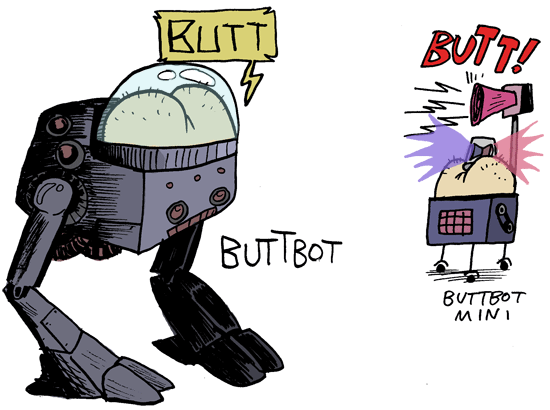

[](https://travis-ci.org/proxa/IRCbutt)

# IRCbutt
A Java IRC bot inspired by buttbot, with various other functionality.

Original ideas, and some borrowed from phrik from #archlinux on freenode



## Download

IRCbutt is built using OpenJDK 1.8

You can test it here: http://alureon.net/irc/

(Or you can just join #afterlunch on freenode)

Download builds here: http://alureon.net/ircbutt

## Running

Run with `java -jar IRCbutt*.jar`

~~You can specify a log level as an argument.  Supported levels are TRACE, DEBUG, INFO, WARNING, ERROR, or INFO.  The default log level is INFO.~~

~~`java -jar IRCbutt*.jar DEBUG`~~

As of version 0.4.4, this project has switched to log4j.  This is no longer supported.

## Usage:
Most commands start with `!` followed by the command name, then arguments.

Fact requests start with a `~` followed immediately by the fact name.

You don't include the brackets `<>`

### Basic Functionality
`!8 <question>`         -  Ask the Magic 8 Ball a question

`!g <query>`            -  Google something

`!gi <query>`           -  Google Image Search

`!buttify <query`       -  Replace random words in the text with 'butt' (for mature audiences only)

`!check <query>`        -  Get a random response on whether or not something passes or fails

`!coin <query>`         -  Get a random heads or tails response

`!echo <query>`         -  Echo something (commands can be echoed with $(command))

`!ud <query>`           -  Search Urban Dictionary

`!dice`                 -  Roll a dice to land on a random user in the room

`!more`                 -  Get more results for facts, quotes, or search results

`!define <query>`       -  Get the definition of a word from Merriam Webster

`!rot13 <query>`        -  Get the rot13 equivalent of `<query>`.  Alias: !rot

`!wr`                   -  Wake the room!  Ping everbody in the room.

`!yt <query>`           -  Search YouTube for `<query>`

`!give <user> <thing>`  -  Give something to someone else

`!version`              -  Get the current bot version

### Math Functionality
`!sqrt <number>`      -  Get the square root of `<number>`

`!pow <num1> <num2>`  -  Get the result of num1^num2

`!eval <expression>`  -  Use Jeval to evaluate an expression. ex: !eval sin(0)

### Fact Functionality
`~<string>`                   -  Any string prefixed with a tilde finds the corresponding fact

`!fact`                       -  Retrieve a random factoid from the database

`!learn <factname> <value>`   -  Write a factoid to the database

`!ff <query>`                 -  Search for a fact by string

`!fi <factnumber>`            -  Get information about a factoid

`!append <factname> <string>` -  Appends `<string>` to a current factoid

`!forget <factname>`          -  Delete a fact from the database (MUST BE CHANNEL OP!)

### Quotegrab Functionality
`!grab <username>`     -  Grab and store the last message from `<user>` in the database

`!rq`                  -  Retrieve a random quote from the database

`!q <username>`        -  Retrieve the last grabbed quote from `<user>`

`!qf <query>`          -  Search for a quote by string query

`!qi <query>`          -  Get information about a quote

`!qsay <quotenum>`     -  Say quote by ID

### Karma Functionality
`<randomstring>++`      -  Increase the karma of `<whatever>`

`<randomstring>--`      -  Decrease the karma of `<whatever>`

`!karma <randomstring>` -  Retrieve the current karma of `<whatever>`

### Configuration File
```
   Bot:
       Name: buttbutt  // the bot's IRC nickname
       Login: buttbutt // the bot's IRC "login" value
       Realname: butt  // the bot's IRC "realname" value
       Password:       // the bot's IRC "password" value
       Message-Delay: 0 // the delay, if any, before sending a message
       No-Verify: false // false if the bot shouldn't learn from unverified users
       Random-Response-Frequency: 100 // chance of butting a message is 1 in this number
   Channels: // a list of channels the bot should join
       - '#afterlunch'
       - '##anotherchannel'
   Server: // standard settings for connecting to IRC servers
       Hostname: 'chat.freenode.net'
       SSL: false // this doesn't work.  don't use it right now.
       Port: 6667
       Auto-Reconnect: true
   SQL: // standard settings for connecting to an SQL database.
       Username: root
       Password: secret
       IP: 127.0.0.1
       Port: 3306
       Database: irc
       Table-Prefix: ircbutt
   ```

## Special Thanks:
- *BullShark* - for ideas, showing me buttbot, and the name 'buttbutt'
- *Klong* - for tons of contributions and several commits
- *ebolahats* - for being a rubber duck and for several commits
- *MandL27* - for breaking the bot and pointing out what's annoying

